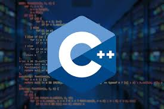

 # Computer Science | Full Stack Developer | AI/ML Research Enthusiast

 Passionate about building tech solutions that make a real-world impact.  
 
Currently working on MindEase – a wearable device and mobile app designed to detect and manage stress in children with Autism. It aims to provide timely alerts and soothing interventions like soft music or Surah recitations. 
 
 Also built projects like a Real Estate Website, AI-Mental-Health-Diagnosis, MindEase, Pizza App, CV-generator and Portfolio Website using HTML, CSS, JavaScript, React Native, Node.js & MongoDB.  
 
 Interested in applying AI/ML in healthcare and mental health diagnostics.

---

##  Tech Stack and Tools

  

    
    
    
    
    
    
    
    
    
    
    
    
    
    
    
    
    

  

---

 **Let's connect**:  
 • [Email](aimen.azhar111333@gmail.com)

