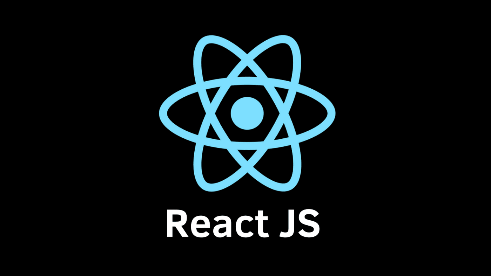

 # Computer Science | Full Stack Developer | AI/ML Research Enthusiast

 Passionate about building tech solutions that make a real-world impact.  
 
 Currently working on **MindEase** – a wearable and mobile system to help children with Autism manage stress.  
 
 Also built projects like a Real Estate Listing App, AI-Mental-Health-Diagnosis, MindEase, Pizza App, CV-generator and Portfolio Website using HTML, CSS, JavaScript, React Native, Node.js & MongoDB.  
 
 Interested in applying AI/ML in healthcare and mental health diagnostics.

---

###  Tech Stack

  
  
  
  
 
  
  
   
  
  
  
  
  
  
  
  

---

###  Pinned Projects
Check out some of my featured projects below!

---

 **Let's connect**:  
 • [Email](aimen.azhar111333@gmail.com)

